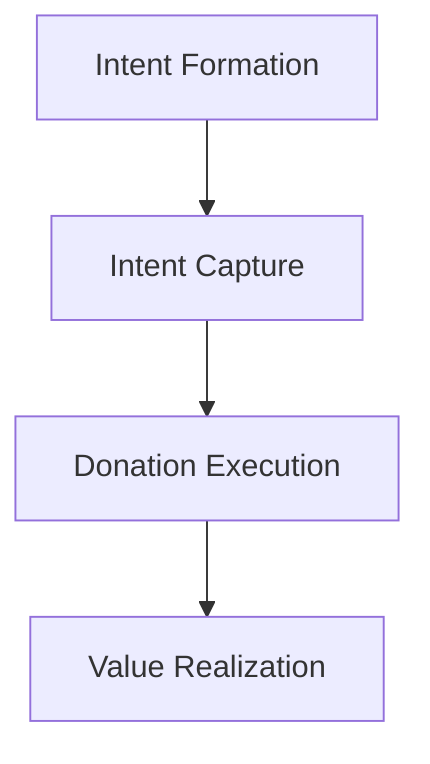

# GPV Impact Calculator

The GPV Impact Calculator is a "what-if" simulator designed for structural reasoning on how donor intent is transformed into economic outcomes. It models the flow of intent through various layers to identify where value is created, where it is lost, and how system changes impact overall capacity.

> [!NOTE]
> The calculator is not predictive. It is a tool for strategic planning, deal sizing, and roadmap impact analysis.

## Core Architecture

The system is organized into four conceptual layers. Each layer builds upon the outputs of the previous one, and no layer is allowed to reach "upstream" semantically or mathematically.



### 1. Intent Formation Layer
Defines the maximum addressable donor intent (TAM) that exists outside the product, independent of channels or surfaces.

### 2. Intent Capture Layer
Transforms exposed intent into structured, executable opportunities by modeling the mix of:
- **Channels**: Online, Offline, Phone, Direct Mail
- **Surfaces**: Website, API, Tap2Pay, etc.
- **Donation Models**: Campaign, P2P, Membership, etc.

### 3. Donation Execution Layer
Converts donation opportunities into successful financial transactions, handling:
- Cadence (One-time vs. Recurring)
- Completion Rates (CR-2)
- Recurring Lifecycle Mechanics

### 4. Value Realization Layer
Aggregates executed donations into final economic value, including:
- Total GPV
- FundraiseUp Revenue
- Organization Net Proceeds

## Tech Stack

- **Frontend**: React 18, TypeScript, TailwindCSS
- **Build Tool**: Vite
- **Testing**: Jest, React Testing Library
- **State Management**: Scenario-based structure defined by JSON schema

## Getting Started

### Prerequisites

- Node.js (v18+)
- npm

### Installation

```bash
npm install
```

### Running Locally

```bash
npm run dev
```
The application will be available at `http://localhost:5173`.

## Development Scripts

- `npm run dev`: Start the development server.
- `npm run build`: Build the production bundle.
- `npm test`: Run the test suite.
- `npm run lint`: Run ESLint for code quality.
- `npm run typecheck`: Run TypeScript type checking.

## Project Structure

- `src/`: Main source code.
    - `components/`: UI components (LayerPanel, Tables, etc.).
    - `services/`: Compute engine and data services.
    - `types/`: TypeScript definitions and schemas.
- `test/`: Test suites and documentation.
- `_inbox/`: PRD, schemas, and contract documentation.
- `_meta/`: Project task list and development metadata.
